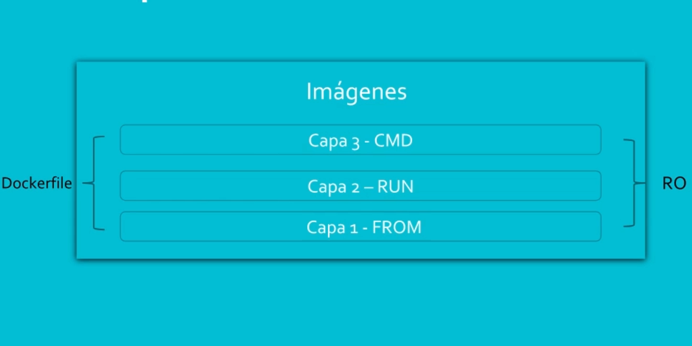

# Recursos
[docker-es-resourcess](https://github.com/ricardoandre97/docker-es-resources)

# Introducción
La imagen equivale al snapshot de un sistema, la misma es la configuración de la app  

Ej: 

```bash
docker run –d –p 80:80 –name web web https # Crea un web server que informa que funciona 
```

```bash
docker rm –fv web # Destruye el servidor 
``` 

# Arquitectura 

Se compone por un host, típicamente un servidor o nuestra PC. 

La REST API es el canal de comunicación entre el cliente  y el server docker. La api es lo que se invoca con el comando docker en si mismo. 


 
# Imagen 

Es un paquete que abarca toda la configuración del servicio. La misma se compone de N capas, un ejemplo podría ser el siguiente:  
|Comando | Uso |
|---|---|
|FROM  | Sistema operativo (mini, menos de 200 Mb) |
|RUN   | Lo que se encuentra dentro del sistema, instalando con apt |
|CMD   | Lo que se ejecuta al correr el servicio, por ejemplo, el inicio de una app |



Estas son de solo lectura (Read Only). Con lo cual solo podemos agregar cosas. 

Esto es lo que se encuentra en el dockerfile, la definición de capas:

Ej.  
```bash
FROM centos:7 # centos7 

RUN yum –y install httpd  # instala apache 

CMD ["apachectl","-DFOREGROUND"] # La app que corre, el servicio vivirá tanto como este comando, por eso va en primer plano 
```

# Contenedor 

Es una capa adicional que trae una ejecución en tiempo real de las capas anteriores. 

 

Esta capa si es de escritura y lectura pero de forma temporal. Con lo cual no es recomendable configurar cosas en la capa 4 .

# Contenedores vs VM 

## VM: 
Requiere asignación estática de recursos sumamente costosa. Además, de instalar un sistema operativo dado, instalará todo lo que venga con el (ej, libre office) 

## Contenedor: 
Solo instala virtualmente instancias mínimas y solo los recursos solicitados, con lo cual, solo utiliza los recursos mínimos e indispensables  

 