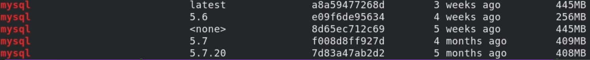
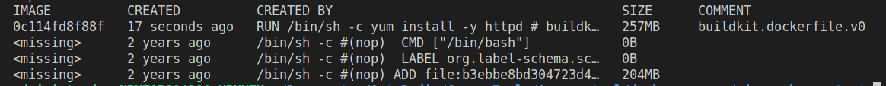
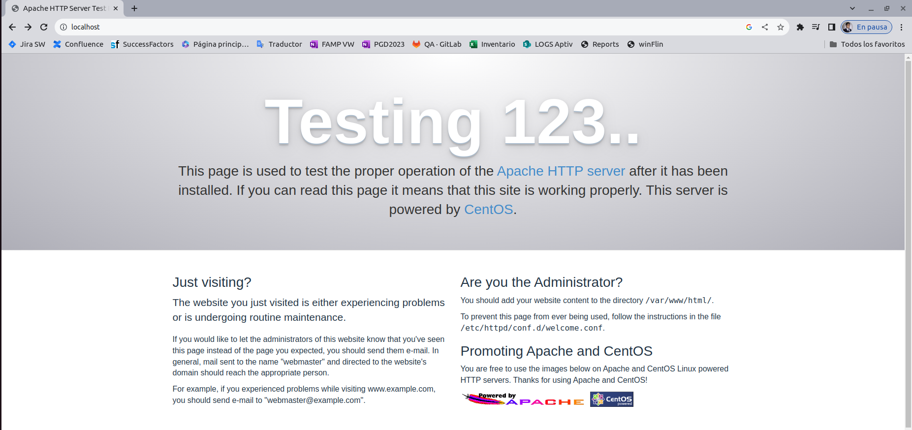

# Oficiales
Creadas por los desarrolladores de cada sistema y servicio (Ubuntu, Centos, Mongo, Espressif)
En DockerHub podemos encontrar estas imagenes

## Tags
Etiqueta que indica la version de la imagen, Lastest es la ultima disponible, de manera que podemos versionar la aplicación 

Si uso varias versiones, solo descargará las capas que sean diferentes, con lo cual optimiza el almacenamiento.

## Uso
```sh
docker pull mongo
```
En este ejemplo, se descarga de docker hub la imagen Mongo

## Ej:  MySQL 
Para ver las versiones que tengo ya disponibles uso 
```sh 
docker images | grep mysql
mysql           latest         b2013ac99101   5 days ago     577MB
```

Puede ocurrir que al hacer el pull, la imagen lastest local no corresponda con la lastest nueva, pero que mi version no sea tampoco un tag valido, entonces la imagen permanece, pero huerfana con el tag _none_



Esto es en realidad más frecuente en las imagenes propias que en las oficiales.

# Imagenes propias
Supongamos que necesitamos Apache y PHP, pero no existe una imagen oficial para tales fines.

## Generando el Dockerfile
```dockerfile
# Capa 1
FROM centos:lastest
# Capa 2, instala apache, el -y es absolutamente necesario 
# porque no hay interacciones con el usuario
# el comando es el que da la documentación de centos
RUN yum install -y httpd
```

```sh 
docker build --tag apache-centos:first-version .
```

Para analizar las capas creadas corro
```sh 
docker history -H apache-centos:first-version
```

Se ven 3 capas propias de centos y una reciente que es propia

## Creación de un contenedor en base a la imagen
```sh 
docker run -d apache-centos # crea el contenedor, -d para que vaya a segundo plano
c7d03f1994472e6d4ea0be9057ec11834d078186a0af952209e288f362b81dd1 # ID
docker ps # mira los contenedores 
CONTAINER ID   IMAGE     COMMAND   CREATED   STATUS    PORTS     NAMES
```
Aca se ve que el contenedor no está, pero deberia porque hay un ID

Viendo todos los registros:
```sh 
docker ps -a # mira los contenedores 
CONTAINER ID   IMAGE                         COMMAND       CREATED         STATUS                     PORTS     NAMES
c7d03f199447   apache-centos:first-version   "/bin/bash"   2 minutes ago   Exited (0) 2 minutes ago             eloquent_rosalind
acf947ff3aa5   hello-world                   "/hello"      23 hours ago    Exited (0) 23 hours ago              confident_wescoff
40159ee361ba   hello-world                   "/hello"      4 months ago    Exited (0) 4 months ago              loving_heisenberg
782cab98bafe   hello-world                   "/hello"      4 months ago    Exited (0) 4 months ago              intelligent_franklin
```
Se ve que existio y murio. Esto se debe a que no defini una capa CMD.

Añadiendo el CMD
```dockerfile
# Capa 1
FROM centos:7
# Capa 2, instala apache, el -y es absolutamente necesario 
# porque no hay interacciones con el usuario
# el comando es el que da la documentación de centos
RUN yum install -y httpd
# Capa 3, apache en foreground
CMD ["apachectl", "-D", "FOREGROUND"]
```
y corriendo todo nuevamente, tendremos:
```sh
docker build --tag apache-centos . # como no aclaro, será lastest
docker run -d --name apache apache-centos
docker ps
CONTAINER ID   IMAGE           COMMAND                  CREATED         STATUS         PORTS     NAMES
ad05f3988294   apache-centos   "apachectl -D FOREGR…"   2 minutes ago   Up 2 minutes             nostalgic_shtern
```
No obstante, la primera imagen sigue existiendo

## Puertos
Puedo mapear un puerto de mi PC con uno del contenedor con la opcion -p

```sh
docker run -d --name apache -p 80:80 apache-centos # pc:contenedor
```
Con esto, levanto el servicio en mi pc dado el mapeo del puerto, entonces, entrando a 
> localhost:80

Veré lo siguiente:

